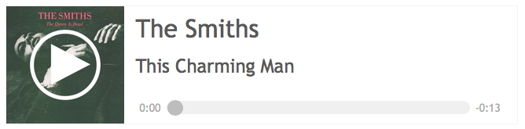
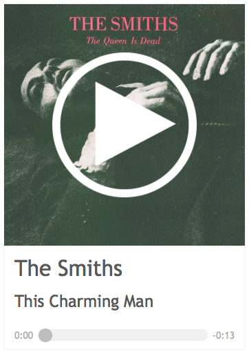

# HTML5 Custom Audio Player

A custom HTML5 audio player template that replaces the standard audio controls with custom artwork, artist name, track name, and custom play / pause elements. The minimum album artwork dimensions should be at least 350 x 350 pixels.

The player has a draggable seek bar and resets at the end of playback.

To see the custom audio player in action head on over to [this demo page](https://jon-dean.github.io/html5-audio-player/index.html).

## Desktop Sample

  

## Mobile Sample

  

